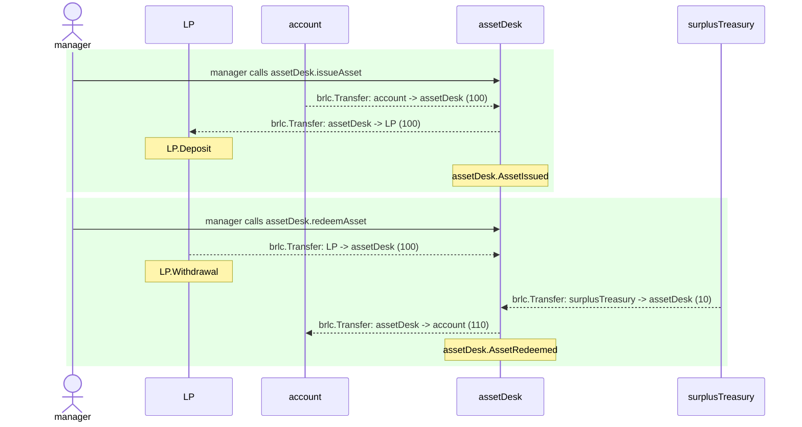

# AssetTransitDesk.test

## simple scenario

| Idx | Caller | Contract | Name | Args |
| --- | ------ | -------- | ---- | ---- |
| 1 | manager | assetDesk | issueAsset | [account, 100] |
| 2 | manager | assetDesk | redeemAsset | [account, 100, 10] |

Step 0: assetDesk.issueAsset

- **type**: methodCall
- **caller**: manager
- **args**: `{
  "buyer": "account",
  "principalAmount": "100"
}`

**Events**

| # | Contract | Event | Args |
| - | -------- | ----- | ---- |
| 1 | brlc | Transfer | `[account, assetDesk, 100]` |
| 2 | brlc | Transfer | `[assetDesk, LP, 100]` |
| 3 | LP | Deposit | `[100]` |
| 4 | assetDesk | AssetIssued | `[account, 100]` |

**Balances**

**Token:** brlc
| Holder | Balance |
| ------ | ------- |
| assetDesk | 0 |
| LP | 10100 |
| brlc | 0 |
| deployer | 0 |
| manager | 0 |
| account | 9900 |
| surplusTreasury | 10000 |
| pauser | 0 |
| stranger | 0 |

Step 1: assetDesk.redeemAsset

- **type**: methodCall
- **caller**: manager
- **args**: `{
  "buyer": "account",
  "principalAmount": "100",
  "netYieldAmount": "10"
}`

**Events**

| # | Contract | Event | Args |
| - | -------- | ----- | ---- |
| 1 | brlc | Transfer | `[LP, assetDesk, 100]` |
| 2 | LP | Withdrawal | `[100, 0]` |
| 3 | brlc | Transfer | `[surplusTreasury, assetDesk, 10]` |
| 4 | brlc | Transfer | `[assetDesk, account, 110]` |
| 5 | assetDesk | AssetRedeemed | `[account, 100, 10]` |

**Balances**

**Token:** brlc
| Holder | Balance |
| ------ | ------- |
| assetDesk | 0 |
| LP | 10000 |
| brlc | 0 |
| deployer | 0 |
| manager | 0 |
| account | 10010 |
| surplusTreasury | 9990 |
| pauser | 0 |
| stranger | 0 |

