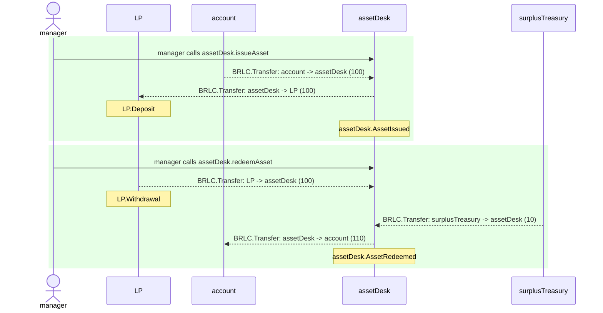
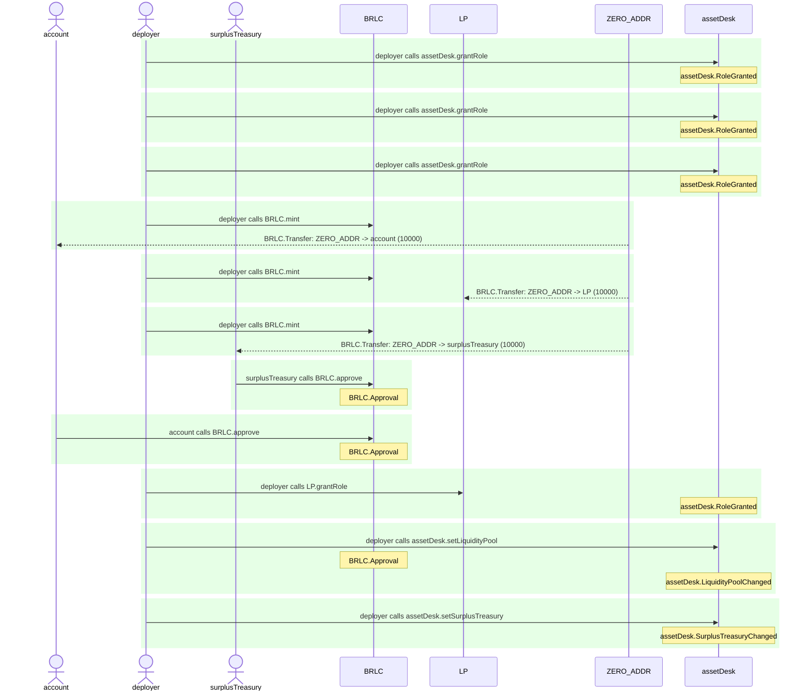

# AssetTransitDesk.test

## simple scenario

| Idx | Caller | Contract | Name | Args |
| --- | ------ | -------- | ---- | ---- |
| 1 | manager | assetDesk | issueAsset | [account, 100] |
| 2 | manager | assetDesk | redeemAsset | [account, 100, 10] |

Step 0: assetDesk.issueAsset

- **type**: methodCall
- **caller**: manager
- **args**: `{
  "buyer": "account",
  "principalAmount": "100"
}`

**Events**

| # | Contract | Event | Args |
| - | -------- | ----- | ---- |
| 1 | BRLC | Transfer | `[account, assetDesk, 100]` |
| 2 | BRLC | Transfer | `[assetDesk, LP, 100]` |
| 3 | LP | Deposit | `[100]` |
| 4 | assetDesk | AssetIssued | `[account, 100]` |

**Balances**

**Token:** BRLC
| Holder | Balance |
| ------ | ------- |
| assetDesk | 0 |
| LP | 10100 |
| BRLC | 0 |
| deployer | 0 |
| manager | 0 |
| account | 9900 |
| surplusTreasury | 10000 |
| pauser | 0 |
| stranger | 0 |

Step 1: assetDesk.redeemAsset

- **type**: methodCall
- **caller**: manager
- **args**: `{
  "buyer": "account",
  "principalAmount": "100",
  "netYieldAmount": "10"
}`

**Events**

| # | Contract | Event | Args |
| - | -------- | ----- | ---- |
| 1 | BRLC | Transfer | `[LP, assetDesk, 100]` |
| 2 | LP | Withdrawal | `[100, 0]` |
| 3 | BRLC | Transfer | `[surplusTreasury, assetDesk, 10]` |
| 4 | BRLC | Transfer | `[assetDesk, account, 110]` |
| 5 | assetDesk | AssetRedeemed | `[account, 100, 10]` |

**Balances**

**Token:** BRLC
| Holder | Balance |
| ------ | ------- |
| assetDesk | 0 |
| LP | 10000 |
| BRLC | 0 |
| deployer | 0 |
| manager | 0 |
| account | 10010 |
| surplusTreasury | 9990 |
| pauser | 0 |
| stranger | 0 |

## configuration scenario

| Idx | Caller | Contract | Name | Args |
| --- | ------ | -------- | ---- | ---- |
| 1 | deployer | assetDesk | grantRole | [0xd10feaa7..70c5af57cf, deployer] |
| 2 | deployer | assetDesk | grantRole | [0x241ecf16..7caa831b08, manager] |
| 3 | deployer | assetDesk | grantRole | [0x65d7a28e..73440d862a, 0x15d34aaf..a00a2c6a65] |
| 4 | deployer | BRLC | mint | [account, 10000] |
| 5 | deployer | BRLC | mint | [LP, 10000] |
| 6 | deployer | BRLC | mint | [surplusTreasury, 10000] |
| 7 | surplusTreasury | BRLC | approve | [assetDesk, 10000] |
| 8 | account | BRLC | approve | [assetDesk, 10000] |
| 9 | deployer | LP | grantRole | [0xa4980720..5693c21775, assetDesk] |
| 10 | deployer | assetDesk | setLiquidityPool | [LP] |
| 11 | deployer | assetDesk | setSurplusTreasury | [surplusTreasury] |

Step 0: assetDesk.grantRole

- **type**: methodCall
- **caller**: deployer
- **args**: `{
  "role": "0xd10feaa7..70c5af57cf",
  "account": "deployer"
}`

**Events**

| # | Contract | Event | Args |
| - | -------- | ----- | ---- |
| 1 | assetDesk | RoleGranted | `[0xd10feaa7..70c5af57cf, deployer, deployer]` |

**Balances**

**Token:** BRLC
| Holder | Balance |
| ------ | ------- |
| assetDesk | 0 |
| LP | 0 |
| BRLC | 0 |
| deployer | 0 |
| manager | 0 |
| account | 0 |
| surplusTreasury | 0 |

Step 1: assetDesk.grantRole

- **type**: methodCall
- **caller**: deployer
- **args**: `{
  "role": "0x241ecf16..7caa831b08",
  "account": "manager"
}`

**Events**

| # | Contract | Event | Args |
| - | -------- | ----- | ---- |
| 1 | assetDesk | RoleGranted | `[0x241ecf16..7caa831b08, manager, deployer]` |

**Balances**

**Token:** BRLC
| Holder | Balance |
| ------ | ------- |
| assetDesk | 0 |
| LP | 0 |
| BRLC | 0 |
| deployer | 0 |
| manager | 0 |
| account | 0 |
| surplusTreasury | 0 |

Step 2: assetDesk.grantRole

- **type**: methodCall
- **caller**: deployer
- **args**: `{
  "role": "0x65d7a28e..73440d862a",
  "account": "0x15d34aaf..a00a2c6a65"
}`

**Events**

| # | Contract | Event | Args |
| - | -------- | ----- | ---- |
| 1 | assetDesk | RoleGranted | `[0x65d7a28e..73440d862a, 0x15d34aaf..a00a2c6a65, deployer]` |

**Balances**

**Token:** BRLC
| Holder | Balance |
| ------ | ------- |
| assetDesk | 0 |
| LP | 0 |
| BRLC | 0 |
| deployer | 0 |
| manager | 0 |
| account | 0 |
| surplusTreasury | 0 |

Step 3: BRLC.mint

- **type**: methodCall
- **caller**: deployer
- **args**: `{
  "account": "account",
  "amount": "10000"
}`

**Events**

| # | Contract | Event | Args |
| - | -------- | ----- | ---- |
| 1 | BRLC | Transfer | `[ZERO_ADDR, account, 10000]` |

**Balances**

**Token:** BRLC
| Holder | Balance |
| ------ | ------- |
| assetDesk | 0 |
| LP | 0 |
| BRLC | 0 |
| deployer | 0 |
| manager | 0 |
| account | 10000 |
| surplusTreasury | 0 |

Step 4: BRLC.mint

- **type**: methodCall
- **caller**: deployer
- **args**: `{
  "account": "LP",
  "amount": "10000"
}`

**Events**

| # | Contract | Event | Args |
| - | -------- | ----- | ---- |
| 1 | BRLC | Transfer | `[ZERO_ADDR, LP, 10000]` |

**Balances**

**Token:** BRLC
| Holder | Balance |
| ------ | ------- |
| assetDesk | 0 |
| LP | 10000 |
| BRLC | 0 |
| deployer | 0 |
| manager | 0 |
| account | 10000 |
| surplusTreasury | 0 |

Step 5: BRLC.mint

- **type**: methodCall
- **caller**: deployer
- **args**: `{
  "account": "surplusTreasury",
  "amount": "10000"
}`

**Events**

| # | Contract | Event | Args |
| - | -------- | ----- | ---- |
| 1 | BRLC | Transfer | `[ZERO_ADDR, surplusTreasury, 10000]` |

**Balances**

**Token:** BRLC
| Holder | Balance |
| ------ | ------- |
| assetDesk | 0 |
| LP | 10000 |
| BRLC | 0 |
| deployer | 0 |
| manager | 0 |
| account | 10000 |
| surplusTreasury | 10000 |

Step 6: BRLC.approve

- **type**: methodCall
- **caller**: surplusTreasury
- **args**: `{
  "spender": "assetDesk",
  "value": "10000"
}`

**Events**

| # | Contract | Event | Args |
| - | -------- | ----- | ---- |
| 1 | BRLC | Approval | `[surplusTreasury, assetDesk, 10000]` |

**Balances**

**Token:** BRLC
| Holder | Balance |
| ------ | ------- |
| assetDesk | 0 |
| LP | 10000 |
| BRLC | 0 |
| deployer | 0 |
| manager | 0 |
| account | 10000 |
| surplusTreasury | 10000 |

Step 7: BRLC.approve

- **type**: methodCall
- **caller**: account
- **args**: `{
  "spender": "assetDesk",
  "value": "10000"
}`

**Events**

| # | Contract | Event | Args |
| - | -------- | ----- | ---- |
| 1 | BRLC | Approval | `[account, assetDesk, 10000]` |

**Balances**

**Token:** BRLC
| Holder | Balance |
| ------ | ------- |
| assetDesk | 0 |
| LP | 10000 |
| BRLC | 0 |
| deployer | 0 |
| manager | 0 |
| account | 10000 |
| surplusTreasury | 10000 |

Step 8: LP.grantRole

- **type**: methodCall
- **caller**: deployer
- **args**: `{
  "role": "0xa4980720..5693c21775",
  "account": "assetDesk"
}`

**Events**

| # | Contract | Event | Args |
| - | -------- | ----- | ---- |
| 1 | assetDesk | RoleGranted | `[0xa4980720..5693c21775, assetDesk, deployer]` |

**Balances**

**Token:** BRLC
| Holder | Balance |
| ------ | ------- |
| assetDesk | 0 |
| LP | 10000 |
| BRLC | 0 |
| deployer | 0 |
| manager | 0 |
| account | 10000 |
| surplusTreasury | 10000 |

Step 9: assetDesk.setLiquidityPool

- **type**: methodCall
- **caller**: deployer
- **args**: `{
  "newLiquidityPool": "LP"
}`

**Events**

| # | Contract | Event | Args |
| - | -------- | ----- | ---- |
| 1 | BRLC | Approval | `[assetDesk, LP, 1157920892..3129639935]` |
| 2 | assetDesk | LiquidityPoolChanged | `[LP, ZERO_ADDR]` |

**Balances**

**Token:** BRLC
| Holder | Balance |
| ------ | ------- |
| assetDesk | 0 |
| LP | 10000 |
| BRLC | 0 |
| deployer | 0 |
| manager | 0 |
| account | 10000 |
| surplusTreasury | 10000 |

Step 10: assetDesk.setSurplusTreasury

- **type**: methodCall
- **caller**: deployer
- **args**: `{
  "newSurplusTreasury": "surplusTreasury"
}`

**Events**

| # | Contract | Event | Args |
| - | -------- | ----- | ---- |
| 1 | assetDesk | SurplusTreasuryChanged | `[surplusTreasury, ZERO_ADDR]` |

**Balances**

**Token:** BRLC
| Holder | Balance |
| ------ | ------- |
| assetDesk | 0 |
| LP | 10000 |
| BRLC | 0 |
| deployer | 0 |
| manager | 0 |
| account | 10000 |
| surplusTreasury | 10000 |

