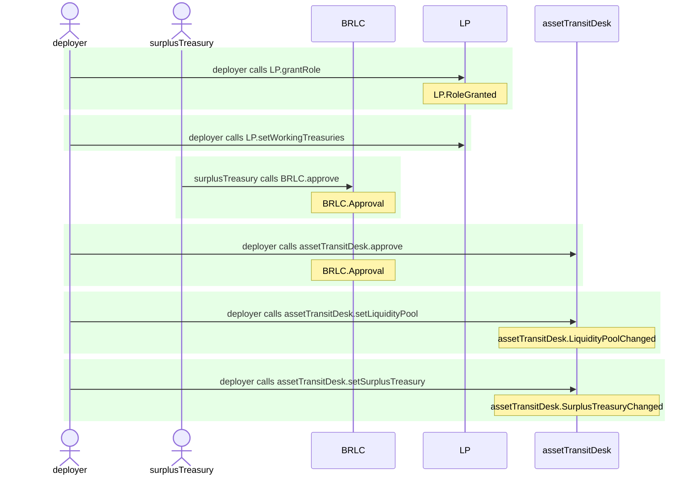

# AssetTransitDesk.test

## Usage example

| Idx | Caller | Contract | Name | Args |
| --- | ------ | -------- | ---- | ---- |
| 1 | manager | assetTransitDesk | issueAsset | [0x69737375..0000000000, account, 100] |
| 2 | manager | assetTransitDesk | redeemAsset | [0x72656465..0000000000, account, 100, 10] |


<details>
<summary>Step 0: assetTransitDesk.issueAsset</summary>

- **type**: methodCall
- **caller**: manager
- **args**: `{
  "assetDepositId": "0x69737375..0000000000",
  "buyer": "account",
  "principalAmount": "100"
}`

**Events**

| # | Contract | Event | Args |
| - | -------- | ----- | ---- |
| 1 | BRLC | Transfer | `[account, assetTransitDesk, 100]` |
| 2 | BRLC | Transfer | `[assetTransitDesk, LP, 100]` |
| 3 | LP | Deposit | `[100]` |
| 4 | assetTransitDesk | AssetIssued | `[0x69737375..0000000000, account, 100]` |

**Balances**

**Token:** BRLC
| Holder | Balance |
| ------ | ------- |
| assetTransitDesk | 0 |
| LP | 10100 |
| BRLC | 0 |
| deployer | 0 |
| manager | 0 |
| account | 9900 |
| surplusTreasury | 10000 |
| pauser | 0 |
| stranger | 0 |


**issueOperation**
```
 [
  1n,
  "0x3C44CdDdB6a900fa2b585dd299e03d12FA4293BC",
  100n,
]
```
**redeemOperation**
```
 [
  0n,
  "0x0000000000000000000000000000000000000000",
  0n,
  0n,
]
```

</details>
<details>
<summary>Step 1: assetTransitDesk.redeemAsset</summary>

- **type**: methodCall
- **caller**: manager
- **args**: `{
  "assetRedemptionId": "0x72656465..0000000000",
  "buyer": "account",
  "principalAmount": "100",
  "netYieldAmount": "10"
}`

**Events**

| # | Contract | Event | Args |
| - | -------- | ----- | ---- |
| 1 | BRLC | Transfer | `[LP, assetTransitDesk, 100]` |
| 2 | LP | Withdrawal | `[100, 0]` |
| 3 | BRLC | Transfer | `[surplusTreasury, assetTransitDesk, 10]` |
| 4 | BRLC | Transfer | `[assetTransitDesk, account, 110]` |
| 5 | assetTransitDesk | AssetRedeemed | `[0x72656465..0000000000, account, 100, 10]` |

**Balances**

**Token:** BRLC
| Holder | Balance |
| ------ | ------- |
| assetTransitDesk | 0 |
| LP | 10000 |
| BRLC | 0 |
| deployer | 0 |
| manager | 0 |
| account | 10010 |
| surplusTreasury | 9990 |
| pauser | 0 |
| stranger | 0 |


**issueOperation**
```
 [
  1n,
  "0x3C44CdDdB6a900fa2b585dd299e03d12FA4293BC",
  100n,
]
```
**redeemOperation**
```
 [
  1n,
  "0x3C44CdDdB6a900fa2b585dd299e03d12FA4293BC",
  100n,
  10n,
]
```

</details>

## Configuration

| Idx | Caller | Contract | Name | Args |
| --- | ------ | -------- | ---- | ---- |
| 1 | deployer | LP | grantRole | [0xa4980720..5693c21775, assetTransitDesk] |
| 2 | deployer | LP | setWorkingTreasuries | [[assetTransitDesk]] |
| 3 | surplusTreasury | BRLC | approve | [assetTransitDesk, 10000] |
| 4 | deployer | assetTransitDesk | approve | [LP, 10000] |
| 5 | deployer | assetTransitDesk | setLiquidityPool | [LP] |
| 6 | deployer | assetTransitDesk | setSurplusTreasury | [surplusTreasury] |



<details>
<summary>Step 0: LP.grantRole</summary>

- **type**: methodCall
- **caller**: deployer
- **args**: `{
  "role": "0xa4980720..5693c21775",
  "account": "assetTransitDesk"
}`

**Events**

| # | Contract | Event | Args |
| - | -------- | ----- | ---- |
| 1 | LP | RoleGranted | `[0xa4980720..5693c21775, assetTransitDesk, deployer]` |

**Balances**

**Token:** BRLC
| Holder | Balance |
| ------ | ------- |
| assetTransitDesk | 0 |
| LP | 0 |
| BRLC | 0 |
| deployer | 0 |
| manager | 0 |
| account | 0 |
| surplusTreasury | 0 |


**liquidityPool**
```
"0x0000000000000000000000000000000000000000"
```
**surplusTreasury**
```
"0x0000000000000000000000000000000000000000"
```

</details>
<details>
<summary>Step 1: LP.setWorkingTreasuries</summary>

- **type**: methodCall
- **caller**: deployer
- **args**: `{
  "newWorkingTreasuries": "[assetTransitDesk]"
}`

**Events**

_No events_

**Balances**

**Token:** BRLC
| Holder | Balance |
| ------ | ------- |
| assetTransitDesk | 0 |
| LP | 0 |
| BRLC | 0 |
| deployer | 0 |
| manager | 0 |
| account | 0 |
| surplusTreasury | 0 |


**liquidityPool**
```
"0x0000000000000000000000000000000000000000"
```
**surplusTreasury**
```
"0x0000000000000000000000000000000000000000"
```

</details>
<details>
<summary>Step 2: BRLC.approve</summary>

- **type**: methodCall
- **caller**: surplusTreasury
- **args**: `{
  "spender": "assetTransitDesk",
  "value": "10000"
}`

**Events**

| # | Contract | Event | Args |
| - | -------- | ----- | ---- |
| 1 | BRLC | Approval | `[surplusTreasury, assetTransitDesk, 10000]` |

**Balances**

**Token:** BRLC
| Holder | Balance |
| ------ | ------- |
| assetTransitDesk | 0 |
| LP | 0 |
| BRLC | 0 |
| deployer | 0 |
| manager | 0 |
| account | 0 |
| surplusTreasury | 0 |


**liquidityPool**
```
"0x0000000000000000000000000000000000000000"
```
**surplusTreasury**
```
"0x0000000000000000000000000000000000000000"
```

</details>
<details>
<summary>Step 3: assetTransitDesk.approve</summary>

- **type**: methodCall
- **caller**: deployer
- **args**: `{
  "spender": "LP",
  "amount": "10000"
}`

**Events**

| # | Contract | Event | Args |
| - | -------- | ----- | ---- |
| 1 | BRLC | Approval | `[assetTransitDesk, LP, 10000]` |

**Balances**

**Token:** BRLC
| Holder | Balance |
| ------ | ------- |
| assetTransitDesk | 0 |
| LP | 0 |
| BRLC | 0 |
| deployer | 0 |
| manager | 0 |
| account | 0 |
| surplusTreasury | 0 |


**liquidityPool**
```
"0x0000000000000000000000000000000000000000"
```
**surplusTreasury**
```
"0x0000000000000000000000000000000000000000"
```

</details>
<details>
<summary>Step 4: assetTransitDesk.setLiquidityPool</summary>

- **type**: methodCall
- **caller**: deployer
- **args**: `{
  "newLiquidityPool": "LP"
}`

**Events**

| # | Contract | Event | Args |
| - | -------- | ----- | ---- |
| 1 | assetTransitDesk | LiquidityPoolChanged | `[LP, ZERO_ADDR]` |

**Balances**

**Token:** BRLC
| Holder | Balance |
| ------ | ------- |
| assetTransitDesk | 0 |
| LP | 0 |
| BRLC | 0 |
| deployer | 0 |
| manager | 0 |
| account | 0 |
| surplusTreasury | 0 |


**liquidityPool**
```
"0x9A9f2CCfdE556A7E9Ff0848998Aa4a0CFD8863AE"
```
**surplusTreasury**
```
"0x0000000000000000000000000000000000000000"
```

</details>
<details>
<summary>Step 5: assetTransitDesk.setSurplusTreasury</summary>

- **type**: methodCall
- **caller**: deployer
- **args**: `{
  "newSurplusTreasury": "surplusTreasury"
}`

**Events**

| # | Contract | Event | Args |
| - | -------- | ----- | ---- |
| 1 | assetTransitDesk | SurplusTreasuryChanged | `[surplusTreasury, ZERO_ADDR]` |

**Balances**

**Token:** BRLC
| Holder | Balance |
| ------ | ------- |
| assetTransitDesk | 0 |
| LP | 0 |
| BRLC | 0 |
| deployer | 0 |
| manager | 0 |
| account | 0 |
| surplusTreasury | 0 |


**liquidityPool**
```
"0x9A9f2CCfdE556A7E9Ff0848998Aa4a0CFD8863AE"
```
**surplusTreasury**
```
"0x90F79bf6EB2c4f870365E785982E1f101E93b906"
```

</details>

